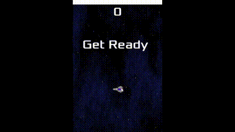
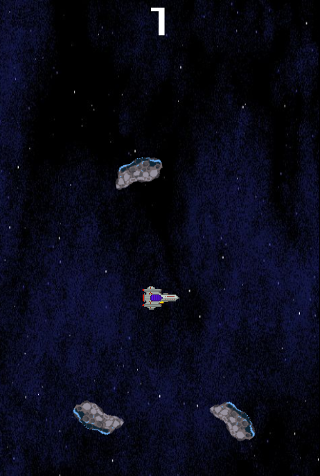

# Asteroid Mania

This is a simple game where your spaceship must move
and avoid the asteroids for as long as possible.

Language: GDScript

Renderer: GLES 3 (particles are not available in GLES 2)

Check out this demo on the asset library: [Asteroid Mania](https://godotengine.org/asset-library/asset/1505)

## Demo

## Screenshot 

## Copyright
Copyright &copy; 2022 [Devian-Art Space Background By M-EverHam](https://www.deviantart.com/m-everham/art/Pixel-Space-BG-311101538), [CC-BY 3.0: Attribution](http://creativecommons.org/licenses/by/3.0/). Source: <a href="https://www.deviantart.com/m-everham/art/Pixel-Space-BG-311101538">

Sprites are from "itch.io". Copyright © 2022 itch corp, [CC0 1.0 Universal](http://creativecommons.org/publicdomain/zero/1.0/). 
Source: https://itch.io/

Font is "Xolonium". Copyright &copy; 2011-2016 Severin Meyer <sev.ch@web.de>, with Reserved Font Name Xolonium, SIL open font license version 1.1. Details are in `fonts/LICENSE.txt`.
